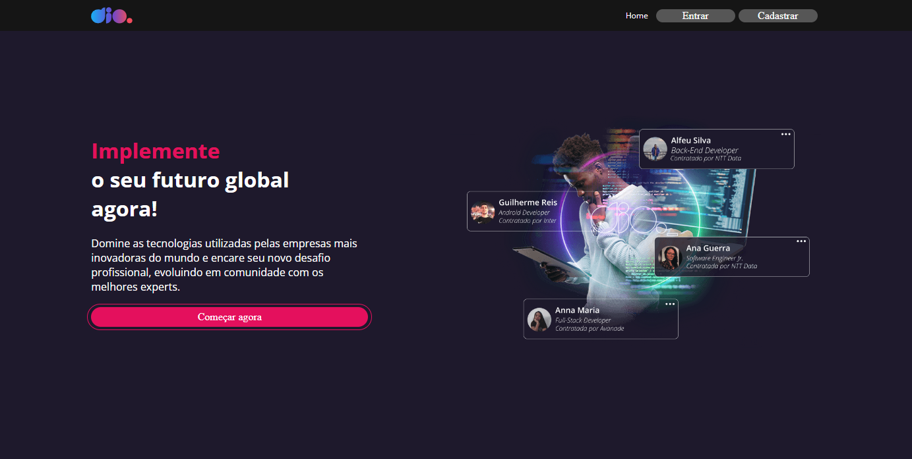
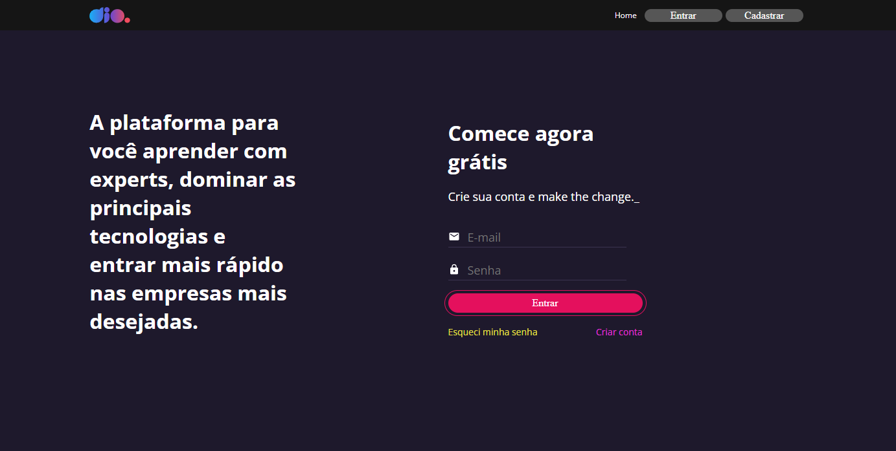
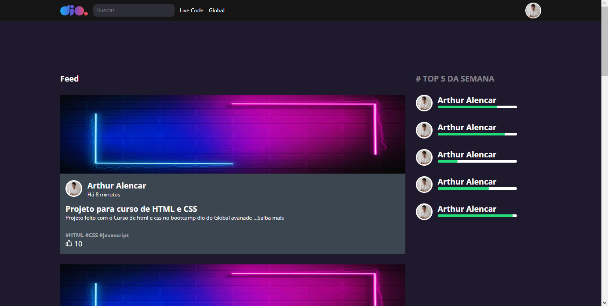
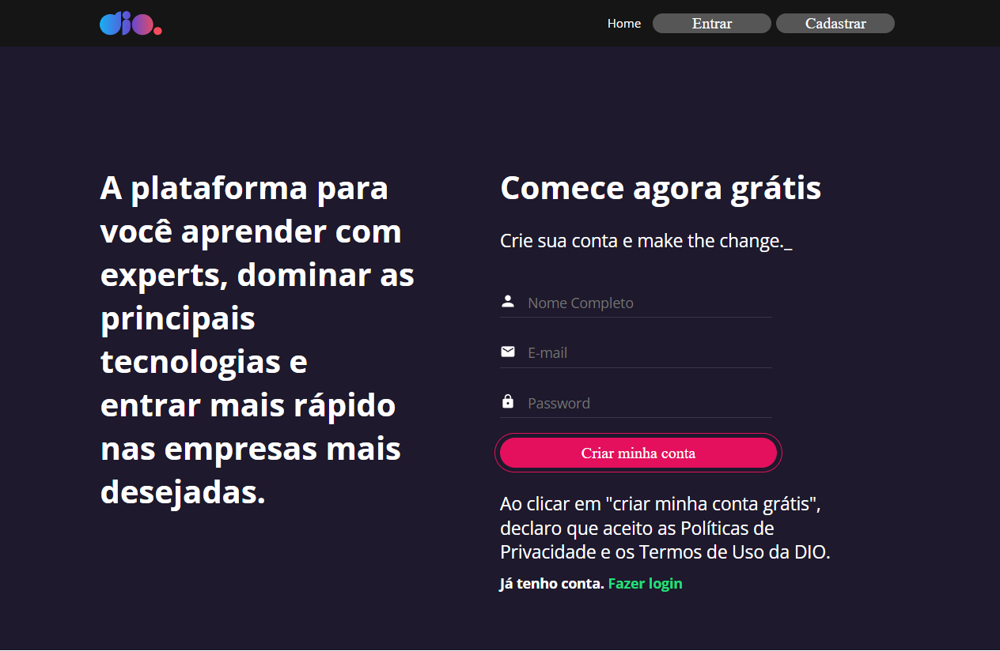

<h1 align="center">Clone DIO</h1>

Projeto realizado para aprender a utilização do Router Dom e styled-components.  

  <a href="#-tecnologias">Tecnologias</a>&nbsp;&nbsp;&nbsp;|&nbsp;&nbsp;&nbsp;
  <a href="#-licença">Licença</a>

  

 

  

  

  

  

---
## 🚀 Tecnologias

Esse projeto foi desenvolvido com as seguintes tecnologias:

- HTML e CSS
- JavaScript
- React

## 📝 Licença

Esse projeto está sob a licença MIT.

---
